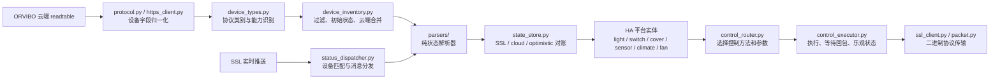

# 贡献指南：新增设备支持

感谢你帮助完善 ORVIBO HomeBridge。本文面向准备提交新设备支持的贡献者，说明当前应用架构、需要提供的真机证据、代码修改位置以及测试要求。

本项目只把经过真机验证的型号写入 README 支持列表。根据字段猜测出的协议可以作为实验性实现提交，但不能标记为“真机验证通过”。

## 开始之前

请从最新 `main` 创建独立分支，不要直接向 `main` 提交：

```bash
git switch main
git pull --ff-only origin main
git switch -c feat/device-<简短型号>
```

一个设备支持 PR 应尽量只包含一个设备类别或一组使用同一协议的型号。协议重构、格式化和无关清理应拆到其他 PR，便于核对真机行为。

## 应用架构

设备从云端记录进入 Home Assistant，大致经过以下链路：



各模块职责如下：

| 模块 | 职责 | 新设备通常是否修改 |
|---|---|---|
| `protocol.py` | 解析 readtable，生成标准化 `OrviboDevice` | 云端字段形态不兼容时修改 |
| `https_client.py` | 调用云端 API，并把记录转换为兼容字典 | 新的发现回退或字段来源出现时修改 |
| `const.py` | 原始类型到 HA 平台的映射 | 通常需要 |
| `device_types.py` | `DeviceCategory`、识别优先级、能力和验证标记 | 必须检查，通常需要 |
| `device_inventory.py` | 初始化状态、隐藏容器、合并云端轮询 | 需要特殊初始字段时修改 |
| `status_dispatcher.py` | 匹配推送中的 ID/UID，选择状态解析器 | 推送形态特殊时修改 |
| `parsers/` | 将原始状态转换成 HA 使用的标准字段 | 有新状态形态时必须修改 |
| `control.py` | 与 HA 无关的命令参数、单位换算 | 新控制语义时修改 |
| `control_router.py` | 按类别选择实际控制方法 | 支持控制时通常需要 |
| `control_executor.py` | 执行路由、等待回包、乐观更新 | 只有特殊生命周期才修改 |
| `packet.py` / `ssl_client.py` | 构造和发送二进制协议包 | 出现新命令或 payload 时修改 |
| HA 平台文件 | 创建实体和暴露能力 | 新平台或新实体时修改 |

### 两层设备映射

当前架构中有两层映射，提交时必须同时检查：

1. `device_types.py` 决定设备属于哪个协议类别。
   - `DeviceCategory`
   - `_CATEGORY_INFO`
   - `_DEVICE_TYPE_MAP`
   - `_UI_MODEL_MAP`
   - `_CLASS_ID_MAP`
2. HA 平台映射决定设备由 `light.py`、`cover.py`、`sensor.py` 等哪个平台创建实体。
   - `const.py::DEVICE_TYPE_MAP`
   - `const.py::CLASS_ID_MAP`
   - `protocol.py::_infer_ha_device_type()` 内的兼容映射

遗漏 HA 平台映射可能使设备落入错误平台。修改 `const.py` 时，应同步检查 `protocol.py::_infer_ha_device_type()`。

### 验证级别

`device_types.py::HARDWARE_VERIFIED_CATEGORIES` 表示维护者对该类别已有真机验证，但它是类别级标记，不会自动证明同类别下每个新型号都已经验证。

- 只有字段证据，没有真机控制结果：可以提交识别、解析和测试，但 README 中应标记为待验证或不加入支持表。
- 已完成真机状态与控制测试：可以更新 README 支持表，并在 PR 中附测试矩阵。
- 无法可靠识别的设备：应保持 `UNKNOWN`/`OTHER`，不得借用“看起来接近”的控制命令。未知类别默认只注册展示，不应发送推测控制。

## 先判断需要哪种改造

### 情况 A：新型号完全复用现有类别

例如一个新的灯具型号，其状态字段、数值单位和控制包与已有类别完全一致。通常只需要：

- 把新的 `deviceType`、`classId`、`subDeviceType` 或 `ui.model` 映射到已有 `DeviceCategory`。
- 更新 HA 平台映射。
- 添加分类、解析和控制回归测试。
- 提交真机证据并更新 README 支持表。

不要仅凭外观或 App 功能相同就复用协议。至少需要一组状态推送和每项控制操作的请求/响应证据。

### 情况 B：新设备需要新的协议类别

如果状态字段、单位、控制顺序或 HA 能力明显不同，应新增 `DeviceCategory`，并完整处理分类、状态解析、控制路由、实体和测试。

### 情况 C：已有设备增加新能力

例如已有门锁增加新的电池字段或事件类型，应优先扩展现有解析器和实体，不要仅为一个字段创建重复类别。

## 提交前需要收集的真机信息

请在 Issue 或 PR 中提供以下内容。所有值必须脱敏。

### 设备身份信息

- 商品名称和准确型号。
- 固件版本、硬件版本；无法获取时注明未知。
- 中国区或国际区。
- Wi-Fi、Zigbee、蓝牙或其他接入方式。
- 是否依赖网关，以及网关型号。
- `deviceType`、`subDeviceType`、`classId`、`statusType`、`ui.model`、`model`。
- App 中可用的完整能力列表。

### 状态样本

至少提供：

- 设备刚上线或集成刚启动时的 readtable 记录。
- 每个物理状态变化对应的 SSL 推送。
- 设备离线和恢复在线的表现。
- 多字段设备的部分更新样本，确认单字段推送不会清空其他状态。
- 数值范围和单位，例如亮度是 `0..100` 还是 `0..255`，色温是 Kelvin 还是 mired。

### 控制样本

每项能力至少验证一次正向和反向操作，例如：

- 开与关。
- 窗帘全开、全关、中间位置和停止。
- 亮度最小值、中间值和最大值。
- 色温冷暖两端。
- 空调模式、目标温度和全部风速。
- 传感器触发和恢复。

记录控制请求、服务端响应以及随后收到的状态推送。只有“命令返回成功”而没有设备动作和状态确认，不能算完成真机验证。

## 抓取诊断信息

`tests/orvibo_probe.py` 可用于本地枚举、监听和门锁事件抓包：

```text
python tests/orvibo_probe.py <用户名> <密码> list
python tests/orvibo_probe.py <用户名> <密码> listen
python tests/orvibo_probe.py <用户名> <密码> lock <家庭索引> <时长秒>
```

建议通过本地环境变量引用账号，避免把明文写入 shell 历史、脚本或截图。该工具只用于你控制的账号和设备。

重要：探针的自动脱敏只覆盖凭据类字段，为了保留本地调试关联，它仍会输出设备 ID、家庭 ID、UID 等标识。生成的 JSONL **不能直接提交**，必须再次人工脱敏。

### 批量家庭支持度审计

如果测试账号可以访问大量家庭，可使用 `tools/bulk_readtable_audit.py` 自动切换家庭、拉取 readtable，并按项目当前的解析器和设备 taxonomy 汇总支持情况：

```powershell
$env:ORVIBO_USERNAME = "你的账号"
$env:ORVIBO_PASSWORD = "你的密码"
python tools/bulk_readtable_audit.py --cloud auto
```

首次建议先处理少量家庭，确认账号区域和输出符合预期：

```text
python tools/bulk_readtable_audit.py --cloud auto --max-families 3
```

脚本顺序处理所有家庭，失败时自动重试，并在每个家庭完成后写入检查点。中断后使用相同的 `--output-dir` 再次执行即可续跑。默认生成：

没有设备表或设备数量为零的家庭会标记为 `empty` 并直接跳过，不计为失败，也不会中断后续家庭。

- `audit-output/report.json`：全部协议特征和支持状态汇总。
- `audit-output/unsupported.csv`：列出仅登记、仅识别、平台映射不一致和解析遗漏的协议特征，便于排序和筛选。
- `audit-output/unsupported-enriched.csv`：本地存在 `tools/device_catalog.json` 时生成，额外包含产品名称、内部型号和目录歧义标记。
- `audit-output/state.json`：本地断点状态，不应提交。

脚本复用集成的 `HttpsClient`，运行环境需要安装 manifest 中声明的 `aiohttp`。Home Assistant 环境已具备该依赖；独立 Python 环境缺少依赖时可执行 `python -m pip install aiohttp`。

如果审计已经完成，后来才取得 `device_catalog.json`，可以在不登录、不重新访问云端的情况下补全现有报告：

```text
python tools/bulk_readtable_audit.py --enrich-existing --output-dir audit-output
```

目录关联使用 `report.descriptor.model → deviceDescList.model → deviceDescId → deviceLanguageList.dataId`。增强报告不会导出 `deviceDescId`，只保留产品名、内部型号、候选数量和是否存在歧义。下载得到的 `tools/device_catalog.json` 以及所有 `audit-output*` 目录均已加入 `.gitignore`，不得随 PR 提交。

官方目录也是集成精确识别设备型号的唯一来源。更新官方目录后，应重新生成可提交的运行时目录：

```text
python tools/generate_known_device_catalog.py tools/device_catalog.json custom_components/orvibohomebridge/known_device_catalog.json
```

生成文件只包含 `model`、中文产品名和内部型号。家庭审计报告用于确认设备覆盖及协议行为，不能用来覆盖官方型号名称；目录中存在某个型号也只代表“已识别”，不代表集成已经支持其状态解析或控制。

支持状态含义：

- `empty`：家庭内没有设备，已正常跳过。
- `supported_verified`：代码支持且维护者已完成真机验证。
- `supported_unverified`：已有分类和代码路径，但尚未声明真机验证。
- `hidden`：项目已识别，但它是网关、父设备或有意不创建 HA 实体的设备。
- `recognized_only`：taxonomy 能识别类别，但没有显式 HA 平台映射。
- `platform_mismatch`：显式平台映射与当前 readtable 归一化结果不一致。
- `registration_only`：只能登记为未知/其他设备，尚无完整实体或控制支持。
- `parser_gap`：readtable 中存在，但当前解析链路没有生成标准设备。

审计文件不会保存原始 readtable、家庭名、房间名、设备名或原始 ID；家庭和设备仅用本次审计的加盐指纹关联。设备型号和协议字段会保留，因为它们是判断支持缺口所必需的信息。即便如此，`audit-output/` 也仅应用于本地分析，提交 Issue/PR 时只摘取人工复核后的最小样本。

推荐使用稳定且明显的占位符，并在同一份样本中保持映射一致：

```json
{
  "familyId": "REDACTED_FAMILY",
  "deviceId": "w-REDACTED_DEVICE",
  "uid": "REDACTED_UID",
  "extAddr": "REDACTED_EXT_ADDR"
}
```

不要用另一组看似真实的 32 位十六进制值代替真实 ID。这样容易被误认为真实数据，也会使自动扫描失效。

## 实现步骤

### 1. 让设备被正确发现和归一化

先为 `protocol.py` 增加最小输入样本测试，确认以下字段进入标准设备字典：

- `device_id`
- `device_type_raw`
- `sub_device_type`
- `class_id`
- `ui_model`
- `uid`、`status_id`、`ext_addr`（如存在）
- 初始 `status`、`properties` 和数值字段

如果 readtable 已能解析这些字段，不要在 `https_client.py` 增加设备专属分支。

### 2. 增加设备分类和 HA 平台映射

在 `device_types.py` 中：

- 尽量使用稳定的 `deviceType` 主映射。
- 只有主类型不唯一时才组合 `subDeviceType`、`statusType`、`classId` 或 `ui.model`。
- 给新类别填写准确的 `CategoryInfo` 和 capabilities。
- 容器、网关或不应创建实体的父设备加入 `HIDDEN_CATEGORIES`。
- 只有真机验证完成后才加入验证声明并更新 README。

随后同步检查 `const.py` 和 `protocol.py::_infer_ha_device_type()` 的 HA 平台映射。

### 3. 编写纯状态解析器

解析器放在最接近设备类型的文件中：

- 灯光：`parsers/light.py`
- 窗帘：`parsers/cover.py`
- 传感器：`parsers/sensor.py`
- 空调、新风、晾衣架：`parsers/appliance.py`
- 门锁：`parsers/lock.py` 和 `lock_status.py`

解析器必须：

- 接收当前状态和原始推送。
- 返回 `StatePatch`。
- 不修改输入参数。
- 容忍缺失字段、字符串数字和异常值。
- 只更新本次报文明确包含的字段，避免部分推送重置其他状态。
- 输出 HA 侧统一单位和语义。

最后在 `parsers/__init__.py::STATE_PARSERS` 注册类别。

### 4. 增加控制支持

如果设备复用现有 SSL 方法，只需在 `control_router.py` 返回正确的 `ControlRoute`。路由需要明确：

- `scope`：`ssl`、`coordinator` 或 `coordinator_uid`。
- 实际方法名。
- 位置参数和关键字参数。
- 超时后的 `optimistic` 状态。

如果协议命令是新的：

1. 在 `control.py` 中实现纯参数和单位换算。
2. 在 `packet.py` 中构造精确 payload。
3. 在 `ssl_client.py` 中增加发送和响应关联。
4. 在 `control_router.py` 中选择新方法。
5. 只有设备需要特殊回包或生命周期时才修改 `control_executor.py` 或 coordinator。

控制参数必须来自真机抓包。PR 中说明 active-low/active-high、范围、单位、位移、默认值和响应命令号。

### 5. 创建或扩展 HA 实体

检查对应平台：

- `light.py`
- `switch.py`
- `cover.py`
- `sensor.py`
- `binary_sensor.py`
- `climate.py`
- `fan.py`
- `camera.py`

实体应满足：

- `unique_id` 稳定，不能包含会变化的名称或房间。
- `device_info` 关联同一 ORVIBO 设备。
- `available` 使用统一在线状态。
- 能力声明与实际真机能力一致。
- 不把密码、token、签名 URL 等秘密放入状态或属性。
- 新增用户可见枚举或实体名称时同步更新中英文翻译。

### 6. 更新文档

真机验证完成后更新：

- `README.md` 支持设备表。
- `CHANGELOG.md` 的 Unreleased 部分。
- 必要的服务说明和翻译。

README 中只写商品型号和协议类型，不写真实设备 ID、家庭 ID、UID、局域网地址或账号信息。

## 自动化测试要求

项目测试尽量避免依赖完整 Home Assistant 环境。可参考现有测试通过动态包加载测试纯模块。

至少根据改动覆盖以下测试：

| 改动 | 必需测试 |
|---|---|
| 新 `deviceType`/`classId`/组合识别 | `tests/test_device_profiles.py` 或新的分类测试 |
| readtable 新字段形态 | `tests/test_protocol.py` |
| 新状态字段或语义 | `tests/test_state_parsers.py` 或设备专用测试 |
| 新控制路由 | `tests/test_control_router.py` |
| 新命令参数换算 | `tests/test_control.py` |
| 新二进制 payload | `tests/test_binary_protocol.py` |
| 特殊回包/乐观更新 | `tests/test_control_executor.py` |
| 特殊 ID 匹配或推送分发 | `tests/test_status_dispatcher.py` |
| 真实抓包样本 | `tests/fixtures/` 加脱敏 fixture 和对应冒烟测试 |

状态解析测试至少断言：

- 正常值。
- 边界值。
- 缺失字段。
- 非法类型。
- 部分更新。
- 输入对象没有被修改。

控制测试应断言精确的方法、参数、单位换算和乐观状态，不能只断言返回值为真。

### 本地运行

安装与 CI 相同的最小依赖：

```bash
python -m pip install "aiohttp>=3.9.0" "cryptography>=41.0.0" "voluptuous>=0.13.1"
```

先运行与设备相关的定向测试，再运行完整测试：

```bash
python -m unittest tests.test_device_profiles tests.test_state_parsers tests.test_control_router
python -m unittest discover -s tests -p "test_*.py"
python -m compileall -q custom_components tests
git diff --check
```

PR 的 GitHub Actions 还会运行：

- Unit tests
- HACS validation
- Home Assistant hassfest

## 真机测试清单

在 PR 描述中复制下面的清单并填写结果：

- [ ] 中国区/国际区登录和重新认证正常。
- [ ] 集成启动后设备能够被发现，名称和区域正确。
- [ ] HA 中只创建预期平台和实体，没有重复实体。
- [ ] 初始状态与 App/实物一致。
- [ ] App 操作能通过 SSL 推送更新 HA。
- [ ] 物理操作能通过 SSL 推送更新 HA。
- [ ] HA 的每项控制都会驱动真实设备。
- [ ] 控制后的回包状态正确。
- [ ] 回包超时时乐观状态合理，后续真实推送能够纠正。
- [ ] 离线和恢复在线状态正确。
- [ ] 重启 Home Assistant 后实体 ID 和设备关联稳定。
- [ ] 未影响同类别的既有设备。

如果设备有危险动作，例如门锁授权、加热、消毒或电机运动，应额外验证输入限制和失败路径。

## 必须提交的内容

一个可审阅的新设备 PR 至少包括：

1. 设备信息表和真机测试清单。
2. 分类与 HA 平台映射。
3. 状态解析实现及单元测试。
4. 控制实现及精确路由/报文测试；只读设备除外。
5. 脱敏后的最小状态/控制样本。
6. README 支持表更新；仅在真机验证完成时添加。
7. 完整测试命令和结果。

推荐把原始抓包缩减成只复现协议形态的最小 fixture。不要上传整个家庭的 readtable 响应。

## 安全与脱敏要求

提交前必须删除或替换：

- 账号、邮箱、手机号和通知目标。
- 明文密码及密码 MD5；密码摘要可直接用于认证，等同密码。
- access token、session ID、session key、dynamic key、签名和 cookie。
- family ID、user ID、device ID、UID、status ID、extAddr、MAC 地址。
- 公网/局域网 IP、家庭名、房间名和可识别的设备名称。
- 临时门锁密码、authorized ID 和用户映射。
- COS 临时凭据、security token、完整签名 URL 和对象键中的私人路径。
- Home Assistant 长期 token、配置目录绝对路径和备份内容。

JSON 字符串内部可能再次嵌套 JSON，必须解码后检查。图片也可能包含实体 ID、临时密码或家庭名称，需要裁剪或打码。

提交前建议扫描：

```bash
git diff --check
git grep -n -I -E "accessToken|sessionKey|sessionId|password|phone|familyId|deviceId|security-token"
```

上述扫描会有合法协议字段命中，必须人工逐条确认值已脱敏。不要通过把秘密拆字符串、编码或加密来绕过检查。

## PR 描述模板

```markdown
## 设备信息

- 商品型号：
- 固件/硬件版本：
- 云区：中国区 / 国际区
- 接入方式：
- 是否依赖网关：
- deviceType：
- subDeviceType：
- classId：
- statusType / ui.model：

## 能力

- 状态：
- 控制：
- HA 平台与实体：

## 协议证据

- 初始状态样本：
- 物理/App 操作推送：
- 控制请求与响应：
- 数值范围、单位和特殊语义：

## 测试

- 定向单测：
- 完整单测：
- 真机测试清单：

## 脱敏确认

- [ ] 不含账号、凭据、token 或密码摘要
- [ ] 不含真实家庭/用户/设备标识
- [ ] 不含 IP、MAC、房间名或私人媒体地址
- [ ] 图片和 JSON 内嵌字符串已人工检查
```

如果证据不足，维护者可能先接受诊断 fixture 或识别改进，而暂缓启用控制。保守地保持设备只读或未验证，比向未知设备发送错误命令更重要。
