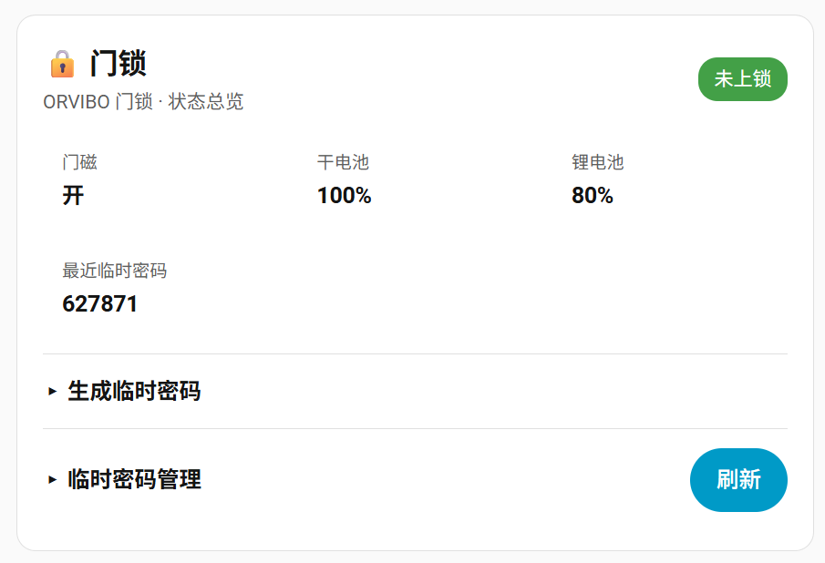

[](https://github.com/hacs/integration)

一个用于 Home Assistant 的欧瑞博（ORVIBO）智能设备集成。通过 SSL 长连接和 MQTT 状态推送，实现对欧瑞博智能家居设备的实时控制和状态监控。

## 📦 安装

### HACS 安装（推荐）

[](https://my.home-assistant.io/redirect/hacs_repository/?owner=mozzie1121&repository=orvibohomebridge&category=integration)

1. 打开 Home Assistant → HACS → 集成
2. 点击右上角 "⋮" → **自定义存储库**
3. 添加：`https://github.com/mozzie1121/orvibohomebridge`，类别：**集成**
4. 搜索 "ORVIBO HomeBridge" 并点击安装
5. 重启 Home Assistant

### 手动安装

将仓库中的 `custom_components/orvibohomebridge` 文件夹复制到 Home Assistant 的配置目录：

```
<ha-config>/custom_components/orvibohomebridge/
```

重启 Home Assistant。

## ✨ 功能特性

- ✅ **实时状态同步**：通过 SSL 长连接和 MQTT 推送，设备状态实时更新
- ✅ **灯光控制**：开关、亮度、色温调节
- ✅ **窗帘控制**：开合控制、位置调节、停止
- ✅ **空调控制**：开关、温度、模式、风速
- ✅ **新风系统**：开关、预设模式（停/慢/快）
- ✅ **传感器支持**：人体传感器、门窗传感器、温湿度传感器、烟雾传感器、可燃气体探测器、紧急按钮、水浸探测器
- ✅ **智能门锁**：门磁状态、锁状态、门铃事件、开锁事件、电池电量监控
- ✅ **智能晾衣机**：照明、消毒、风干、热干、升降
- ✅ **自动发现**：自动识别区域服务器和家庭 ID

## 🔧 支持的设备

下表列出的设备均由项目维护者使用真实设备验证通过，并非仅依据协议字段推测支持。
后续重构会将这些型号作为已验证设备档案保留；未列出的型号即使能够被发现，也不代表
已经验证控制能力，建议先提交设备信息和日志确认兼容性。

### 灯光设备
| 设备类型 | 支持功能 |
|---------|---------|
| S2 智能防眩射灯 | 开关、亮度、色温调节 |
| S3 系列射灯 | 开关、亮度、色温调节 |
| S5 系列射灯 | 开关、亮度、色温调节 |
| S10 系列射灯 | 开关、亮度、色温调节 |
| 柔光 系列射灯 | 开关、亮度调节 |
| 磁吸轨道系列 | 开关、亮度、色温调节 |
| 智能灯带控制器 | 开关、亮度、色温调节 |
| 0-10V 调光模块（调光模式） | 开关、亮度调节 |
| 0-10V 调光模块（色温模式） | 开关、亮度、色温调节 |
| MixSwitch系列开关（一二三四开）| 开关控制 |
| TouchClassic系列开关（一二三开）| 开关控制|
| Gauss系列开关（一二三开）| 开关控制 |
| Defy系列开关（一二三开）| 开关控制 |
| BACH系列开关（一二三开）| 开关控制 |
| 单色灯 (deviceType=501, subDeviceType=426/429) | 开关控制 |
| 普通开关 (deviceType=102) | 开关控制 |
| 可调光灯 (deviceType=502) | 开关、亮度调节 |
| 调光调色灯 (deviceType=38) | 开关、亮度、色温 |
| 色温灯带 (deviceType=503) | 开关、亮度、色温 |

### 窗帘设备
| 设备类型 | 支持功能 |
|---------|---------|
| Zigbee 窗帘 (deviceType=34) | 开合控制、位置调节、停止 |
| 管状电机 (deviceType=35, subDeviceType=-2) | 开合控制、位置调节、停止 |
| 梦幻帘 (deviceType=506, subDeviceType=408) | 开合、位置、停止、叶片角度；仅完全关闭时允许调角度 |

### 空调设备
| 设备类型 | 支持功能 |
|---------|---------|
| 风机盘管空调 (deviceType=36) | 开关、温度、模式、风速 |
| MixPad 地暖面板 (deviceType=300, subDeviceType=481) | 开关、目标温度、当前温度和湿度 |
| 地暖控制面板 (deviceType=112, subDeviceType=-2, orb_floorheat) | 开关、目标温度、当前温度 |

### 新风系统
| 设备类型 | 支持功能 |
|---------|---------|
| 新风系统 (deviceType=516) | 开关、预设模式（停/慢/快） |

### 传感器设备
| 设备类型 | 支持功能 |
|---------|---------|
| 人体传感器 (deviceType=26) | 人体检测、电池电量 |
| 门窗传感器 (deviceType=46) | 门磁状态、电池电量 |
| 温湿度传感器 (deviceType=300, subDeviceType=491) | 温度、湿度、电池电量；保持独立实体，不与地暖面板强制绑定 |
| 烟雾传感器 (deviceType=27) | 烟雾检测、电池电量 |
| 可燃气体探测器 (deviceType=25) | 气体检测（长供电，无电量传感器） |
| 紧急按钮 (deviceType=56) | 按钮触发状态、电池电量、3分钟自动恢复 |
| 水浸探测器 (deviceType=54) | 水浸检测、电池电量 |

### 智能门锁
| 设备类型 | 支持功能 |
|---------|---------|
| 智能门锁 (deviceType=522) | 门磁状态、锁状态、门铃事件、开锁事件、干电池电量、锂电池电量 |

**门锁截图实体**：每把门锁还会生成一个 `camera` 实体（`门锁截图`），事件到达时
自动更新为最新截图（门铃抓图/撬锁告警图），门锁卡片上直接显示，无需额外配置。
注意这是事件快照，不是实时视频（猫眼实时流走 SEP2P 私有协议，暂不支持）。

### 其他设备
| 设备类型 | 支持功能 |
|---------|---------|
| 智能晾衣机 (deviceType=52) | 照明、消毒、风干、热干、升降 |

`deviceType=102` 当前统一按普通开关处理，`deviceType=0` 当前统一按调光灯处理；后续
设备清单出现反例时再按型号或 subtype 收紧。`deviceType=10086` 虚拟灯组不会创建可控
实体。强电电机模式（`deviceType=37`）也暂不接入，等待补充完整控制与状态回包验证。

集成内置了由 ORVIBO 官方 `device_catalog` 生成的完整精确型号识别目录。家庭审计数据只用于
确认设备覆盖情况、协议特征和控制能力，不作为型号名称来源。目录中的未支持设备会在配置
流程中显示“已识别：产品名，暂未支持”，但不会仅凭相同的 `deviceType`、
`subDeviceType=-2` 或状态字段落入灯光、传感器等其他平台。生成后的目录只保存公开产品型号、
产品名称和内部型号，不包含家庭、房间、账号或设备 ID。

## 🔧 配置

### 通过 UI 配置

1. 在 Home Assistant 中，进入 **设置** → **设备与服务** → **添加集成**
2. 搜索 **ORVIBO HomeBridge**
3. 集成会自动检测账号属于中国区还是国际区，并将区域记录在配置项中；多个区域的
   账号可以同时使用，彼此不会共享或覆盖 API/SSL 主机状态。
4. 输入您的欧瑞博账号（手机号）和密码
5. 选择家庭（如果有多个）
6. 完成配置，所有支持的设备将自动添加

如果之后修改了智家365账号密码，可在该集成的 **配置** 菜单中选择 **重新登录**。验证成功后
只会刷新当前配置项的认证信息，不会删除家庭、已选设备、实体、区域分配或门锁用户映射。

### 配置参数

| 参数 | 说明 |
|------|------|
| username | 欧瑞博账号（手机号） |
| password | 欧瑞博密码（仅在提交配置时用于生成协议摘要，不保存明文） |
| family_id | 家庭 ID（可选，自动获取） |

## 📱 使用说明

### 设备控制

- **灯光**：在 Home Assistant 中可以控制开关、亮度、色温
- **窗帘**：支持开合控制和位置调节（0-100%）
- **空调**：支持开关、温度调节、模式切换、风速调节
- **新风**：支持开关和风速模式切换（停/慢/快）

### 传感器状态

- **人体传感器**：检测到人体时触发，30秒后自动恢复
- **门窗传感器**：实时监测门/窗的开关状态
- **温湿度传感器**：实时监测温度和湿度
- **烟雾传感器**：检测到烟雾时触发报警
- **可燃气体探测器**：检测到可燃气体时触发报警

### 智能门锁

- **门磁状态**：监测门的开关状态
- **锁状态**：上锁 / 未上锁 / 门内反锁 / 异常（门磁开但锁上锁，异常关门或测试状态）
- **门铃事件**：有人按门铃时触发，5秒后自动恢复
- **开锁事件**：记录开锁方式（指纹、密码等），5秒后自动恢复
- **电池电量**：分别显示干电池和锂电池的电量百分比

#### 开锁事件属性

**开锁事件** 传感器（状态显示 `张三开门` / `用户2开门` / `无`）附带以下属性：

| 属性 | 说明 |
|------|------|
| `unlock_type` | 开锁方式，见下方取值表 |
| `unlock_user_id` | 用户 ID |
| `unlock_user_name` | 用户名称（在配置 → 锁用户映射 中设置后才有） |
| `unlock_time` | 事件时间戳（Unix 秒） |

`unlock_type` 取值：

| 值 | 含义 |
|------|------|
| `fingerprint` | 指纹 |
| `password` | 密码 |
| `face` | 人脸 |
| `card` | 卡片 |

#### 事件总线（自动化推荐）

所有门锁状态/事件都会发布到 HA 事件总线 `orvibohomebridge_lock_event`，开锁事件（`kind=unlock`）字段：

| 字段 | 类型 | 说明 |
|------|------|------|
| `kind` | string | `unlock` |
| `device_id` | string | 锁设备 ID |
| `unlock_type` | string | 开锁方式：`fingerprint` 指纹 / `password` 密码 / `face` 人脸 / `card` 卡片 |
| `unlock_user_id` | int | 用户 ID |
| `unlock_user_name` | string | 用户名称（配置映射后才有） |
| `time` | int | 事件时间戳（Unix 秒） |

其他事件类型（`kind`）：`error_unlock` 开锁失败、`picklock` 撬锁、`door_unclose` 门未关、
`leave_home` 离家防护报警、`ring` 门铃、`message` 门锁文本消息。

**媒体字段**：带图片/视频的事件（撬锁告警、门铃抓图、门锁消息配图）附带以下临时 URL
（通过门锁专用 COS 凭证签名，默认 10 分钟有效，可放进通知或前端直接访问）：

| 字段 | 类型 | 说明 |
|------|------|------|
| `media_url` | string | 事件视频地址（如撬锁告警 h264） |
| `pic_media_url` | string | 事件图片地址（如撬锁告警截图/门锁消息配图） |
| `doorbell_media_url` | string | 门铃抓图地址 |

集成启动后会在后台预取门锁 COS 凭证（36 小时有效），事件到达时即时签名。

**事件录像**：带 `video_url` 的事件（撬锁/离家告警录像，`.h264` 裸流）会在后台自动
下载并转封装为 MP4，事件附带：

| 字段 | 类型 | 说明 |
|------|------|------|
| `video_file` | string | 本地 MP4 路径（`config/media/orvibohomebridge/...`，转码完成后可播放） |
| `media_id` | string | HA 媒体浏览器引用 ID（`media-source://...`） |

也可通过服务 `orvibohomebridge.fetch_video` 主动拉取任意录像（返回 `video_file` /
`media_id` / `mp4_file`）：

```yaml
action: orvibohomebridge.fetch_video
data:
  device_id: w-example-door-lock-id
  object_key: "{{ trigger.event.data.video_url }}"
response_variable: video_result
```

视频转封装使用 ffmpeg（`-c copy` 无损，秒级完成）；HA 环境通常自带，缺失时录像
仍会以 `.h264` 原文件保存（`h264_file` 字段）。

#### 事件历史回溯

门铃/撬锁/离家等事件触发时，截图与录像会自动归档到
`config/media/orvibohomebridge/<设备>/`（文件名为 `<事件类型>_<时间戳>`）。
HA 侧边栏 → **媒体** → 媒体浏览器打开即可按时间倒序浏览全部历史记录，
点击截图/视频即可回溯查看。

也可通过服务 `orvibohomebridge.list_events` 查询结构化历史：

```yaml
action: orvibohomebridge.list_events
data:
  device_id: w-example-door-lock-id
  limit: 50
response_variable: history
```

返回每条记录含 `kind`（ring/picklock/leave_home 等）、`time`、`type`
（image/video）与 `media_id`（媒体浏览器引用）。服务响应不会暴露 Home Assistant
主机上的绝对文件路径。
有"有人逗留"等新事件类型时也会自动归档，无需额外配置。

**自动清理**：历史记录默认保留 7 天，集成启动时清理一次，之后每周自动执行
（删除超过 7 天的截图/录像及空目录）。也可手动清理或调整保留策略：

```yaml
action: orvibohomebridge.cleanup_history
data:
  keep_days: 7
  max_entries: 500   # 可选：每个设备最多保留 500 条，按时间裁剪
```

## 🔑 临时密码

支持下发临时密码到门锁（实测通过：type=1 限时 / type=2 临时，最多 4 个有效密码，
可选短信通知、自动回收过期密码）。

### 下发临时密码（自动化/手动）

```yaml
action: orvibohomebridge.grant_temp_password
data:
  device_id: w-example-door-lock-id   # 可选，留空自动选第一把门锁
  type: 2              # 1=限时 2=临时（默认）
  minutes: 1440        # 有效期（分钟），type=1 可用 start_time/end_time 指定绝对时间
  number: 1            # 可用次数（0=不限）
  name: 快递员          # 可选
  phone: "13800138000" # 可选，同步短信通知该手机号
response_variable: temp
```

`grant_temp_password` 的服务响应会一次性包含新生成的密码，请将响应按密钥处理，
不要写入持久日志或公开通知。`list_temp_passwords` 只返回授权元数据，不会再次返回
密码明文；事件总线和传感器状态同样不包含密码。

返回：`password`（6 位临时密码）、`authorized_id`、`start_time`/`end_time`、`number` 等。
同时触发事件 `orvibohomebridge_temp_password_event`，但事件不会携带密码；密码只在本次
服务响应的 `password` 字段中返回，避免进入事件总线和 Recorder 历史。

### 管理

```yaml
# 删除（authorized_id 来自下发响应或查询）
action: orvibohomebridge.revoke_temp_password
data:
  device_id: w-example-door-lock-id
  authorized_id: 101

# 查询当前有效密码（含过期状态）
action: orvibohomebridge.list_temp_passwords
data:
  device_id: w-example-door-lock-id
```

**自动回收**：每 6 小时检查一次，已过期（结束时间到）或次数用尽的临时密码自动删除。
集成不会创建显示密码的传感器，以免临时密码被状态历史和备份长期保存。

`list_temp_passwords` 通过 REST `readtable` 的 `authorizedUnlock` 表拉取**服务器端完整列表**
（实测字段含 `authorizedId/password/number/unlockNum/startTime/phone` 等），
卡片"临时密码管理"列表即显示服务器端全部授权（含删除/过期状态）。

**自动化示例**（按门铃自动生成并通知）：

```yaml
triggers:
  - trigger: event
    event_type: orvibohomebridge_lock_event
    event_data:
      kind: ring
actions:
  - action: orvibohomebridge.grant_temp_password
    data:
      minutes: 30
      number: 1
      name: 门铃访客
    response_variable: temp
  - action: notify.mobile_app_phone
    data:
      title: 访客临时密码
      message: "访客临时密码：{{ temp.password }}，30 分钟内有效"
```

## 🃏 门锁卡片（内嵌，无第三方插件）

集成自带一张**门锁卡片**（纯原生 JS，不依赖任何第三方卡片插件）。卡片整合：
锁状态/门磁/干电池/锂电池总览、事件缩略图流（有人来访/逗留/异常开门，点击看大图）、
临时密码下发（含短信通知）与临时密码管理（查看/删除/过期状态，默认折叠）。

**使用方法**：重启 HA 后，编辑任意仪表盘 → 添加卡片 → 搜索 **ORVIBO 门锁**，
卡片会自动识别门锁设备（也可手动配置 `device_id`）：

```yaml
type: custom:orvibo-door-lock-card
device_id: w-example-door-lock-id   # 可选，留空自动选第一把门锁
```

自动化示例（按用户过滤）：

```yaml
triggers:
  - trigger: event
    event_type: orvibohomebridge_lock_event
    event_data:
      kind: unlock
conditions:
  - condition: template
    value_template: "{{ trigger.event.data.unlock_user_id == 2 }}"
actions:
  - action: notify.mobile_app_phone
    data:
      title: 开门通知
      message: >-
        {{ trigger.event.data.unlock_user_name
           | default('用户' ~ trigger.event.data.unlock_user_id) }} 开门了
```

## 📷 界面预览

### 智能晾衣机控制页面


### 智能门锁卡片



## 🔀 传输模式（融合版）

集成已融合局域网与云端双通道（`orvibo-lan-control` 的 LAN 引擎并入本集成）：

- **自动（默认）**：LAN 网关直连优先，实时状态与控制走局域网；LAN 不支持或网关
  不可达的设备（门锁、晾衣机等 WiFi 直连设备）自动走云端。
- **仅云**：所有设备走云端通道，适合不想使用局域网通道的环境。

在 **设置 → 设备与服务 → ORVIBO HomeBridge → 选项** 中切换，默认自动。

### 从旧版迁移

- 若同时安装过 `orvibo_lan`（LAN 集成），融合后请卸载它，实体统一由本集成提供；
  旧实体如需保留记录，可在卸载前导出，卸载后由本集成重新注册。
- 配置条目、家庭、设备选择、锁用户映射均兼容，无需重建。

## 🏗️ 工作原理

```
┌──────────────────┐       HTTPS        ┌─────────────────────┐
│   Config Flow     │◄──────────────────►│  Orvibo REST API    │
│   (配置发现)       │  OAuth + family    │  (port 443)         │
└─────────┬─────────┘                     └─────────────────────┘
          │
          │  配置完成后:
          ▼
┌──────────────────┐     TLS 1.2        ┌─────────────────────┐
│   Coordinator     │◄──────────────────►│  Orvibo Binary API  │
│   (状态推送 +      │   双向认证          │  (port 10002)       │
│    命令控制)       │   AES-ECB JSON     │                     │
└──────────────────┘                     └─────────────────────┘
```

1. 通过欧瑞博 REST API 发现区域服务器和家庭 ID
2. 通过双向 TLS 认证建立二进制协议长连接
3. 通过推送（SSL 通道上的 MQTT）实时接收设备状态更新
4. 按需发送控制命令

## 🏗️ 项目结构

```
orvibohomebridge/
├── custom_components/
│   └── orvibohomebridge/     # HACS 自定义集成
│       ├── __init__.py       # 集成入口，平台注册
│       ├── manifest.json     # 集成元数据
│       ├── config_flow.py    # 配置流程
│       ├── coordinator.py    # HA 生命周期与领域编排
│       ├── const.py          # 常量定义
│       ├── device_types.py   # 设备分类
│       ├── device_inventory.py # 设备发现与云端状态合并
│       ├── parsers/          # 分类状态解析器
│       ├── status_dispatcher.py # SSL 状态匹配与分发
│       ├── control_router.py # 纯控制路由决策
│       ├── control_executor.py # 控制执行与乐观状态兜底
│       ├── lock_manager.py   # 门锁事件归一化与去重
│       ├── lock_media_manager.py # 门锁截图、录像与历史
│       ├── temp_password_manager.py # 临时密码生命周期
│       ├── https_client.py   # HTTP API 客户端
│       ├── ssl_client.py     # SSL 连接客户端
│       ├── packet.py         # 数据包构造
│       ├── functions.py      # 工具函数
│       ├── light.py          # 灯光平台
│       ├── cover.py          # 窗帘平台
│       ├── climate.py        # 空调平台
│       ├── switch.py         # 开关平台
│       ├── sensor.py         # 传感器平台
│       ├── binary_sensor.py  # 二元传感器平台
│       ├── fan.py            # 新风系统平台
│       └── certs/            # SSL 证书
├── hacs.json                 # HACS 配置
├── brand/                    # 品牌图标
├── screenshots/              # 界面截图
└── README.md
```

## 📝 协议说明

本项目通过以下方式与欧瑞博云服务通信：

1. **HTTP API**：获取设备列表、家庭信息、初始状态
2. **SSL 长连接**：实时接收设备状态推送和事件通知
3. **MQTT 推送**：通过 SSL 通道接收设备状态变化

### SSL 客户端证书说明

`certs/client_cert.pem` 与 `certs/client_key.pem` 来自公开 GitHub 项目中可获取的
厂商 App 共享客户端证书。本集成已验证：连接 ORVIBO SSL 推送服务时必须提供这组
证书，因此它们会随 HACS 安装包一同分发。

这组文件是协议兼容材料，而不是每位用户独有的秘密或身份凭据。任何安装本集成的
人都能读取其中的私钥；服务端也不能据此区分不同 Home Assistant 实例。对 PEM 文件
做可逆加密或代码混淆没有实际安全收益，因为无人值守连接所需的解密密钥仍必须随
集成分发。真正需要保护的是 HomeMate 账户密码、访问令牌和临时门锁密码；本集成不
会把这些信息写入证书文件。

配置项不会保存 HomeMate 明文密码，而是保存协议要求的大写 MD5 摘要。旧版配置项
会在升级时自动迁移并删除原有明文字段。该摘要可以直接用于认证，安全等级等同密码，
仍应作为秘密保护，不应出现在日志、诊断或 URL 查询参数中。

## 🐛 已知问题

- 部分设备类型可能未完全支持

## 🤝 贡献

欢迎提交 Issue 和 Pull Request！新增设备支持前请阅读
[贡献指南：新增设备支持](CONTRIBUTING.md)，其中说明了架构接入点、真机证据、
脱敏要求和测试清单。

## 📄 许可证

MIT License

## 🙏 致谢

yecao@hassbian 提供coco插座插排测试

https://github.com/jzgods/ORVIBO_Device_Control

https://github.com/abb3421/orvibo_switch

https://github.com/kjanko/orvibo-homeassistant-curtains
