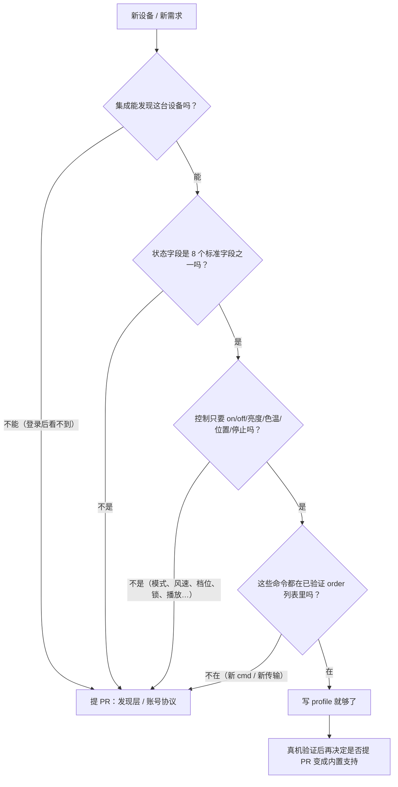

# 什么时候配置够用，什么时候必须提 PR

本页回答一个问题：**我需要的东西，profile 能不能表达？** 不能表达的部分必须走代码 PR（[CONTRIBUTING.md](../../CONTRIBUTING.md)）。

## 一句话判断

> profile 只能**重新组合**已经真机验证过的命令与状态字段；任何需要"新命令、新传输、新参数语义、新状态字段、新实体"的需求，都必须改代码。

## 配置够用的情形

| 需求 | 用 profile 怎么做 |
|---|---|
| 新型号灯，开关命令是 `on/off` + `value1..4` | `platform: light` + `on`/`off`/`brightness`/`color_temp` 动作，见 [02-platforms.md](02-platforms.md#light) |
| 新型号灯，属性报文是 `onoff.status` | `order: set property` + `properties`（动态数值用 `"param:brightness"` 占位符） |
| 亮度单位不同（0-100 ↔ 0-255、×10、百分比） | `scale` |
| 色温单位不同（mired ↔ Kelvin） | `input_unit` / `output_unit` |
| 开关位 active-low（`value1 = 0` 表示开） | `true_values: [0]` / `false_values: [1]`，或控制里写死 `value1` |
| 状态里带电量、温度、湿度（也在 8 个字段内） | `state` 里的 `battery` / `temperature` / `humidity` |
| 只读传感器 | `platform: sensor` + `status_only: true` |
| 门窗磁/水浸等布尔设备 | `platform: binary_sensor` + `state`（`true_values`/`false_values`/`map`） |
| 窗帘位置 0-100 或只有开/关 | `platform: cover` + `position`（+ `stop`） |
| WiFi 直连设备只能走云 | `cloud_only: true` |
| 设备只能走网关/本地 | `channels: [lan]` |
| 设备已被内置识别，但你要改行为 | `override: true`（高风险） |
| 设备只是需要登记展示、暂不控制 | 不写 `control`（自动只读） |

## 必须提 PR 的情形

| 需求 | 为什么 profile 做不到 |
|---|---|
| 新的 `cmd` 号（不是 `cmd=15` 控制报文） | profile 只会产生 `cmd=15` 的 `ssl_control_envelope`；命令号是写死在 `packet.py` 里的 |
| 新的 `order` 字符串 | `KNOWN_ORDERS` 是白名单（`on`/`off`/`open`/`stop`/`set property`/`move to level`/`fast move to level`/`fast color temperature`），其它字符串会在加载时被拒绝 |
| 新的传输通道（BLE、红外、局域网直连新协议、WiFi 直连新协议） | `channels` 只有 `lan`/`ssl` 两种；新通道要有新的 client 与生命周期代码 |
| WiFi 摄像头 / 视频、门锁事件与临时密码、媒体播放 | 需要新的实体平台、事件归一化和媒体链路 |
| 空调模式/风速、新风档位、晾衣机各功能、多路开关的每个通道 | `KNOWN_CONTROL_ACTIONS` 里没有这些动作，也没有对应的自定义实体；`climate`/`fan` 目前根本没有自定义实体 |
| 需要新的状态字段（例如 PM2.5、门锁电量分级、设备自定义事件） | `KNOWN_STATE_FIELDS` 只有 8 个，写别的字段会在加载时报错 |
| 需要新的能力/实体类型（摄像机、门锁、场景按钮、select/number 实体） | 实体类是代码，profile 不能创建新实体类型 |
| 需要新的参数语义（位域打包、需要读回包再决定下一次命令、需要多步握手） | 值规格只能做取值/换算/裁剪，不能做多步协议 |
| 需要新的 HA 平台映射或设备选择分组 | 属于 `device_types.py` / `device_selection.py` 的代码 |

## 为什么要有这个硬限制

- **只发真机验证过的命令**：所有 `order` 都是维护者在真机上验证过的；profile 只是换了一种组合方式，不会凭空发明协议；
- **不会悄悄破坏已有设备**：命中内置已识别的设备必须显式 `override: true`（见 [01-schema.md](01-schema.md#override内置识别优先)）；
- **未验证不下发**：没有 `hardware_verified: true` 的 profile 只登记、不控制（见 [01-schema.md](01-schema.md#hardware_verified--status_only--cloud_only--channels)）；
- **失败不影响其它设备**：坏 profile 只影响它自己，孤立在 `custom:<id>` 类别里，内置设备继续正常工作。

## 推荐路径：先用 profile 拿证据，再提 PR

profile 是**收集证据**的好工具，而且不需要等待代码合并：

1. 用 profile 把设备跑起来（先只登记，确认状态解析正确）；
2. 抓取状态推送与控制请求/响应，做脱敏（见 [04-troubleshooting.md](04-troubleshooting.md#提-issue-前的脱敏)）；
3. 确认哪些能力是真实可用的（例如"亮度 0-255 可用，色温字段无效"）；
4. 如果这套映射对其它用户也有价值（同型号/同协议），把它整理成 Issue/PR：
   - 按 [CONTRIBUTING.md](../../CONTRIBUTING.md) 的模板提供设备信息、状态样本、控制样本、验证清单；
   - 说明哪些字段/命令已经真机验证；
   - 维护者会把它变成内置 `DeviceCategory` + 解析器 + 路由 + 测试，之后所有用户开箱即用。

即使不打算提 PR，也建议把验证过的 profile 留在自己 HA 配置目录里（`<HA config>/orvibohomebridge/devices/`），它不会被升级覆盖。

## 维护者视角：内置样例目录

`custom_components/orvibohomebridge/custom_devices/` 是**随集成发布**的样例目录（HACS 升级会覆盖它），里面只放：

- 通用模板（例如 `example_demo_light.yaml`）；
- 维护者确认可以公开发布、且不针对具体用户的示例。

用户自己的设备 profile 请一律放在 `<HA config>/orvibohomebridge/devices/`：既不会被升级覆盖，也不会把真实设备标识带进仓库。两个目录扫描顺序与同名 `id` 的覆盖规则见 [01-schema.md](01-schema.md#加载失败与错误处理)。

## 相关页面

- 字段全表：[01-schema.md](01-schema.md)
- 平台与限制：[02-platforms.md](02-platforms.md)
- 已知限制清单：[03-recipes.md](03-recipes.md#暂时做不到的配方已知限制)
- 排查：[04-troubleshooting.md](04-troubleshooting.md)
